# Credit-scoring

💻 💳 Программа «Кредитный скоринг», написанная в рамках ВКР на тему «Аналитическая система на основе плоскослоистой нейронной сети прямого распространения для анализа кредитоспособности заемщика».

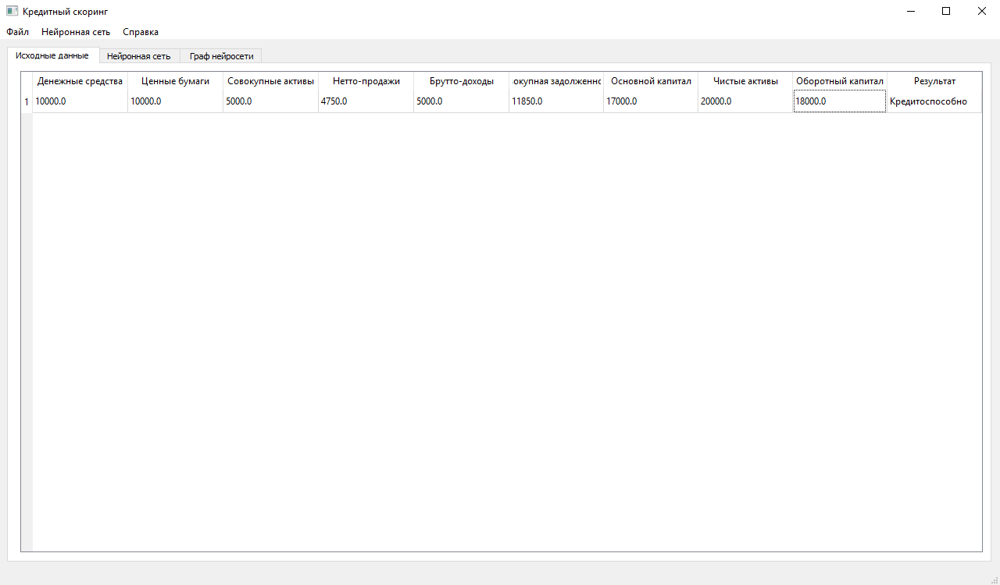

## 📄 Описание

Программа «Кредитный скоринг» позволяет оценить кредитоспособность заёмщика, используя плоскослоистую нейронную сеть прямого распространения. Такая система необходима банкам, она должна повысить число возвращенных кредитов, тем самым улучшив финансовое положении кредитной организации. Неправильная оценка кредитоспособности может привести к потере ликвидности банка и дальнейшему банкротству. 

### 💻 Работа программы

> **Примечание:** Данный пример показывает то, как пользоваться программой, он не содержит исходные наборы данных.

В качестве примера проанализируем следующие данные от заемщика:

| Имя поля                 | Значение |
|:-------------------------|---------:|
| Денежные средства        | 10000    |
| Ценные бумаги            | 10000    |
| Совокупные активы        | 5000     |
| Нетто-продажи            | 4750     |
| Брутто-доходы            | 5000     |
| Совокупная задолженность | 11850    |
| Основной капитал         | 17000    |
| Чистые активы            | 20000    |
| Оборотный капитал        | 18000    |

После запуска откроется главное окно программы:

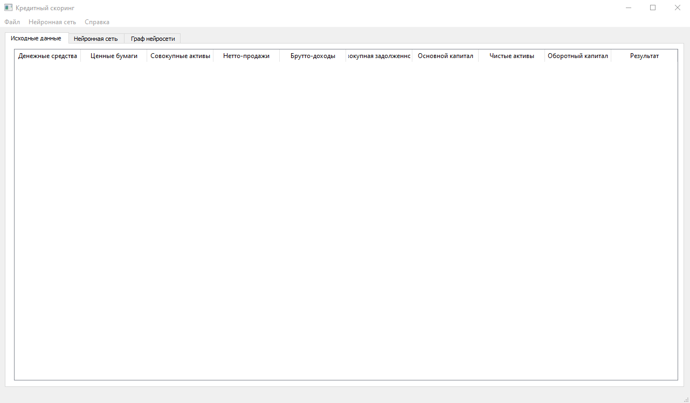

Алгоритм анализа кредитоспособности заемщика:

1. Ввести данные о заемщике в таблицу с исходными данными:

Для этого небходимо нажать правую кнопку мыши в поле таблицы (откроется контекстное меню):

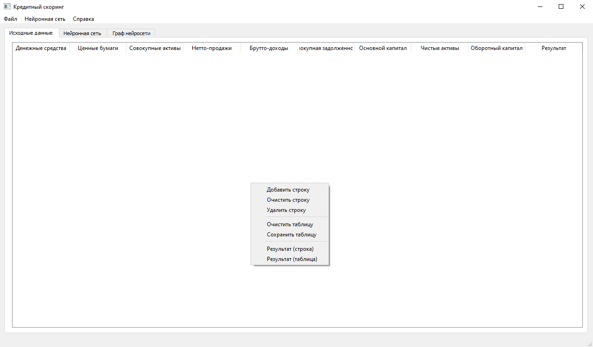

В появившемся меню следует выбрать пункт **Добавить строку** (пустая строка добавится в таблицу):

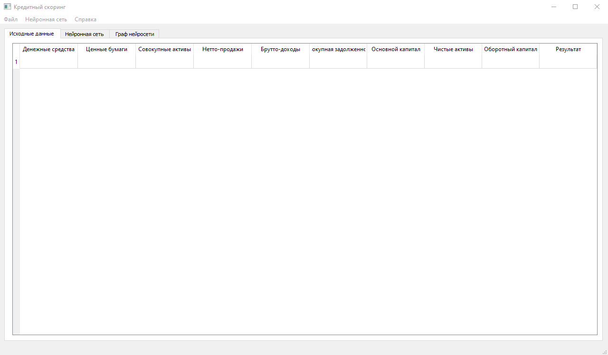

Далее введем информацию о заемщике из таблицы с исходными данными в программу:

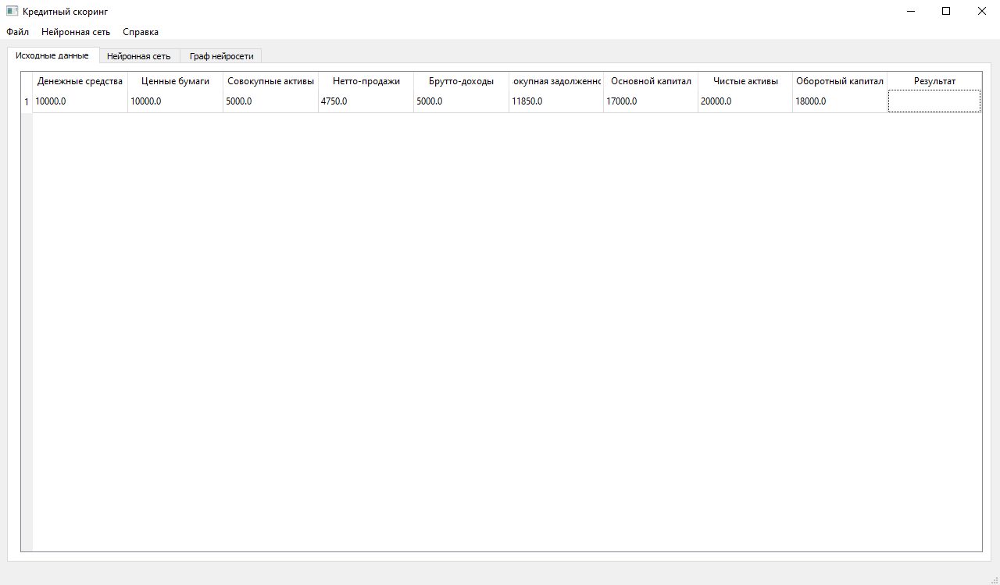

2. Настройка параметров нейронной сети:

После заполнения таблицы следует перейти на вкладку **Нейронная сеть** главного окна программы, для этого необходимо навести курсор мыши на вкладку
**Нейронная сеть** и нажать левую кнопку мыши (откроется вкладка **Нейронная сеть**):

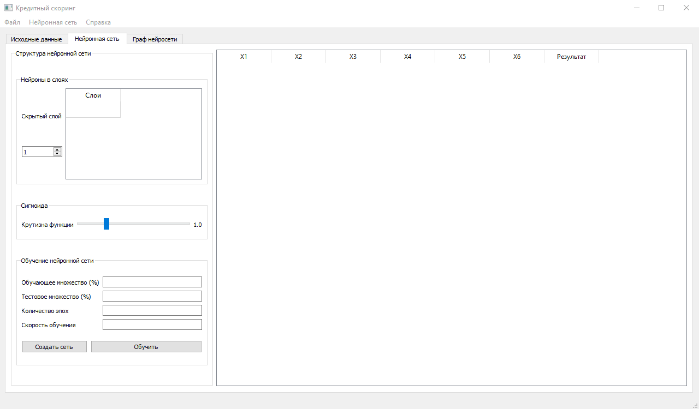

С помощью переключателя выберем **Количество нейронов в скрытом слое**, к примеру, *6*. **Крутизну сигмоиды** оставим как есть. В поле для ввода **Обучающее
множество** введем *50*, в **Тестовое множество** — *25*, в **Количество эпох** — *5000*, в **Скорость обучения** – *0,1* и нажмем кнопку **Создать сеть**.

Настроенная нейронная сеть:

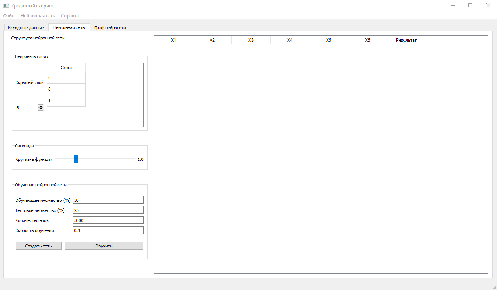

В результате создалась нейронная сеть и построился ее граф во вкладке **Граф нейросети**:

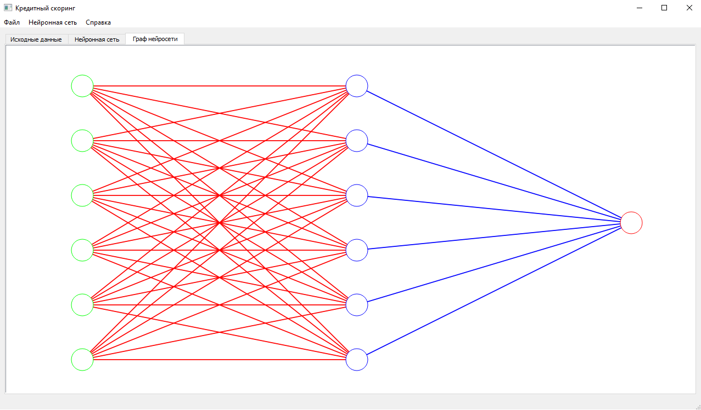

3. Обучение нейронной сети:

Данные для обучения представляют собой рассчитанные коэффициенты для модели Чессера:

`Y = −2,0434 − 5,24 ∗ X1 + 0,0053 ∗ X2 − 6,6507 ∗ X3 + 4,4009 ∗ X4 − 0,0791 ∗ X5 − 0,1220 ∗ X6`, где

* **X1** — (денежные средства + быстрореализуемые ценные бумаги) / совокупные
активы;
* **X2** — нетто-продажи / (денежные средства + быстрореализуемые ценные
бумаги);
* **X3** — брутто-доходы / совокупные активы;
* **X4** — совокупная задолженность / совокупные активы;
* **X5** — основной капитал / чистые активы;
* **X6** — оборотный капитал / нетто-продажи.

Для загрузки обучающих данных в программу необходимо навести курсор мыши на пункт меню **Файл**, затем нажать левую кнопку мыши. В открывшемся меню следует выбрать пункт меню **Загрузить данные для обучения…** Далее следует выбрать какой тип файла загрузить (*.txt) или (*.csv). Для примера выберем CSV-файл (пункт меню **Загрузить из CSV-файла**), как показано на рисунке:

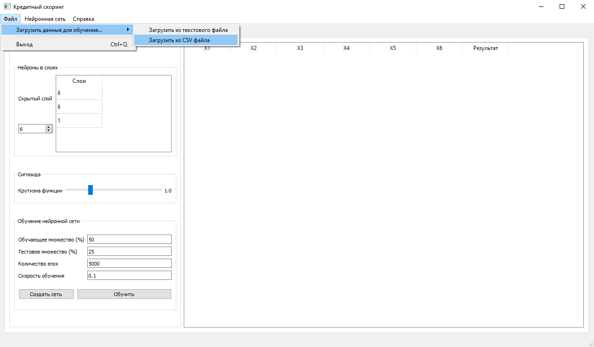

После выбора файла с данными для обучения он загрузится в таблицу:

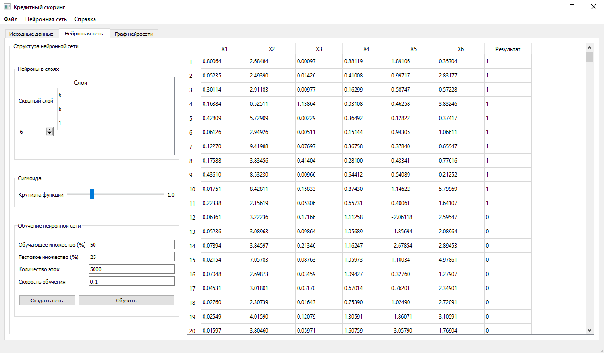

Затем следует нажать на кнопку **Обучить** и нейронная сеть начнет обучаться:

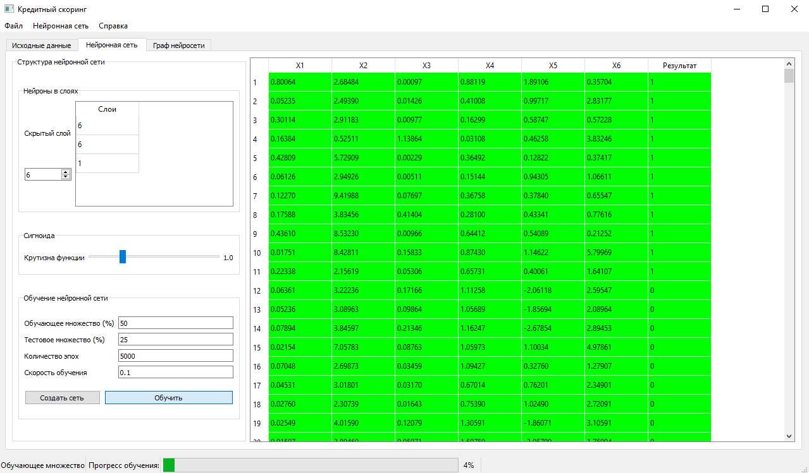

Результат обучения представлен на рисунке:

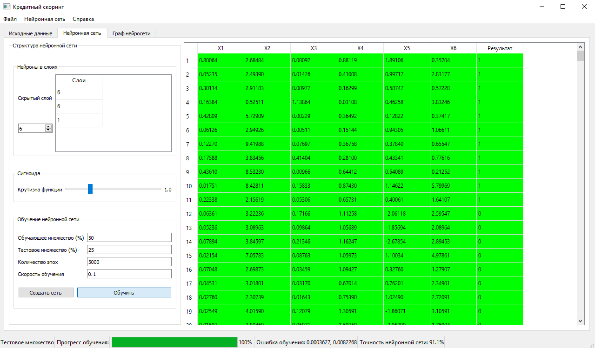

Графики сигмоиды и величины ошибки показаны на рисунке:

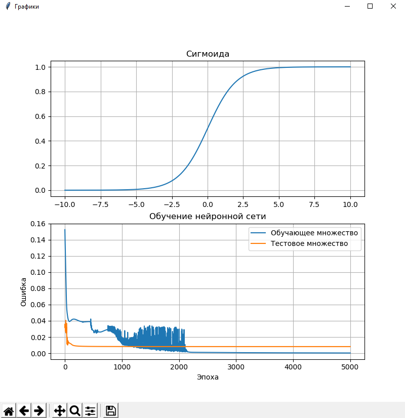

4. Сохранение и загрузка нейронной сети:

В программе можно сохранить хорошо обученную сеть для дальнейшего использования. Для этого необходимо навести курсор на пункт меню **Нейронная сеть** и в открывшемся меню выбрать пункт **Сохранить сеть**, либо сохранить сеть можно с помощью сочетаний клавиш `Ctrl+K`. 

Пример файла конфигурации приведен на рисунке:

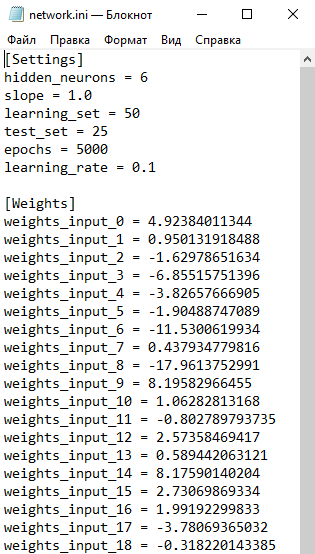

В данном файле сохраняются все необходимые данные для создания сети, а именно:
  * Число скрытых нейронов;
  * Кривизна сигмоиды;
  * Размер обучающего и тестового множества;
  * Количество эпох;
  * Скорость обучения;
  * Веса всех связей нейронов.

Для загрузки файла конфигурации нейронной сети, необходимо навести на пункт меню **Нейронная сеть**, в появившемся меню выбрать пункт **Загрузить сеть** или нажать сочетание клавиш `Ctrl+L`.

5. Результаты предсказания кредитоспособности заемщика:

После обучения следует вернуться на вкладку **Исходные данные** и открыть контекстное меню таблицы. В открывшемся меню необходимо выбрать пункт **Результаты (таблица)**, если в таблице множество строк, а чтобы получить результат предсказания для одной строки, как в нашем случае, необходимо выделить ее левой кнопкой мыши, затем нажать правую кнопку мыши и в открывшемся меню выбрать пункт **Результаты (строка)**. В поле **Результат** отобразится результат предсказания кредитоспособности заемщика, если в данном поле будет значение **Кредитоспособно**, то заемщик с высокой долью вероятности вернет кредит, если **Не кредитоспособно**, то заемщик кредит скорее всего не вернет.

Результат предсказания кредитоспособности заемщика представлен на рисунке:

## 🔧 Техническая часть

* Проект реализован на платформе **PyQT5**.

### 🧩 Архитектура

### :blue_book: Требования

Установленный интерпретатор [Python](https://www.python.org/downloads/), скачанный с официального сайта.

### :cd: Установка

1. В [releases](https://github.com/snikitin-de/Credit-scoring/releases) скачать архив с последней версии программы;
2. Распаковать архив;
3. В терминале:
   1. Ввести команду `cd %APP_PATH%` для перехода в папку с программой, где `%APP_PATH%` — путь до папки, в которую был распакован архив с программой;
   2. Ввести команду `pip install -r requirements.txt` для установки необходимых библиотек.

### 💾 Использование

Для выполнения программы необходимо в терминал ввести команду:

`python main.py`
